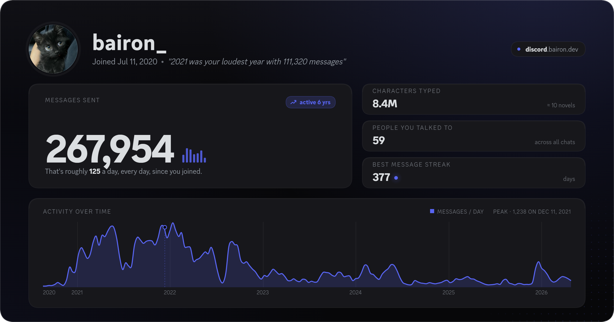

# Discord Package Explorer 🔍

Your Discord data export, finally readable. Browse every conversation, scroll years of photos, and see the patterns hiding in your message history.

*The share card you get from the Stats page.*

## What you can do 💬

- **Browse every conversation.** DMs, group chats, and server channels, all in one sidebar.
- **Scroll your media gallery.** Every image and video you sent or received, with filters for photos, videos, or both. Click any one to open it full-screen, flip through with the arrow keys, and jump back to the message it came from.
- **Search anything.** Across the whole archive or inside one chat, with highlighted snippets.
- **See your stats.** Peak hour, longest streak, year-by-year activity, top conversations, an hourly activity chart, and a trophy for the very first message you ever sent.
- **Make a share card.** A clean image of your headline numbers, your activity timeline, and one fun fact pulled from your data. *(Pictured above.)*

## Quickstart 🚀

### 1. Get your Discord data 📦

1. In Discord, open **User Settings** (gear icon).
2. Go to **Privacy & Safety**.
3. Click **Request all of my Data**.
4. Wait for Discord's email, then download the ZIP. Leave it zipped.

### 2. Open the viewer 🌐

- **Online:** drop your ZIP onto **[discord.bairon.dev](https://discord.bairon.dev)**.
- **Local:** install [Node.js](https://nodejs.org) 18+, then run `npm install && npm run dev` and open `http://localhost:5173`.

## Privacy 🔒

Your ZIP is parsed in your browser. Nothing is uploaded, nothing is stored on a server. Be mindful when sharing screenshots, they may contain private conversations.
