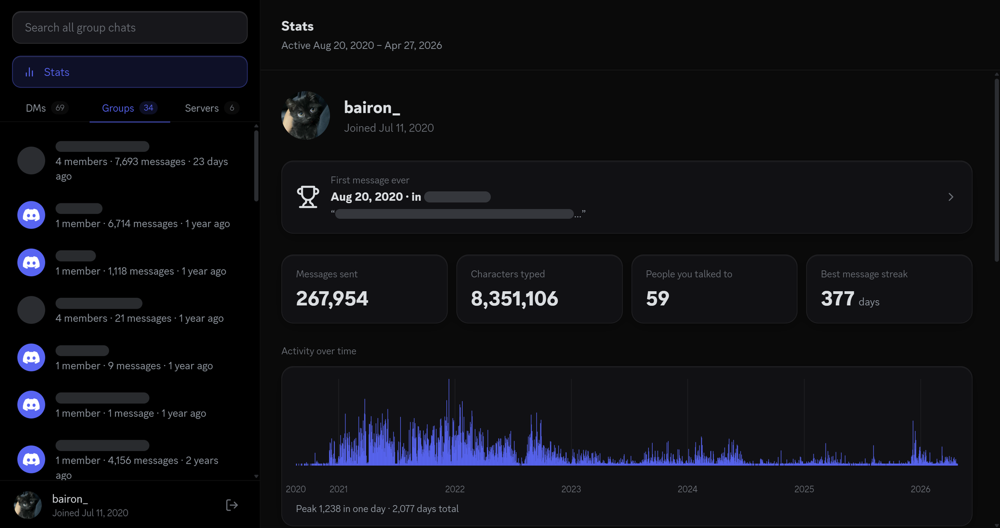

# Discord Package Explorer 🔍



Browse every message you have ever sent on Discord, along with your photos, videos, and stats, straight from the ZIP file Discord gives you. Everything stays on your computer; nothing is ever uploaded.

## Getting your Discord package 📦

1. Open Discord and go to **User Settings** (the gear icon near your name)
2. Click **Privacy & Safety**
3. Scroll down to **Request all of my Data** and click it
4. Wait for Discord to email you a download link (this can take up to 30 days)
5. Click the link in the email and download the ZIP file

Keep the file as a ZIP. Do not unzip or extract it.

## Opening the viewer 🌐

**Option A: use the website (easiest)**

Go to **[discord.bairon.dev](https://discord.bairon.dev)** and drag your ZIP file onto the page, or click to browse for it.

**Option B: run it locally**

You need [Node.js](https://nodejs.org) installed. Open a terminal in this folder and run:

```
npm install
npm run dev
```

Then open the address it prints in your browser and drag your ZIP onto the page.

## Core Features 💬

- **Conversations**: see every message you sent across DMs, group chats, and server channels
- **Search**: find any message you sent, globally or inside a single chat
- **Media gallery**: every photo and video you sent, with a full-screen viewer
- **Stats**: message counts, active hours, longest streak, top conversations
- **Offline**: nothing leaves your device
- **Mobile friendly**: works on phones and tablets

## What you can do ✨

Find that message you sent years ago, see which servers and chats you were most active in, or scroll through every file you ever shared. This is a view of your side of Discord, every word you typed, every image you posted.

## Privacy 🔒

Your ZIP file is read directly in your browser. It is never sent to a server or stored anywhere outside your device. Only open your package on a device and network you trust, and be mindful of sharing screenshots that might contain private conversations.

## Tips

- Drop the ZIP as-is, do not unzip it first
- Large packages (several GB) may take a minute to load; a progress bar will keep you updated
- On mobile, use the navigation bar at the bottom to switch between sections
